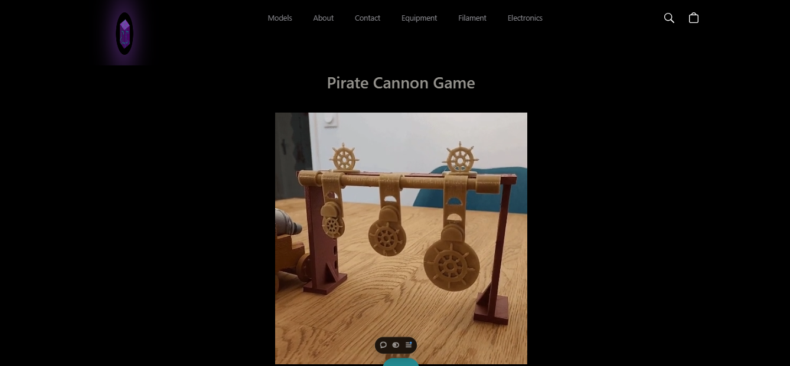
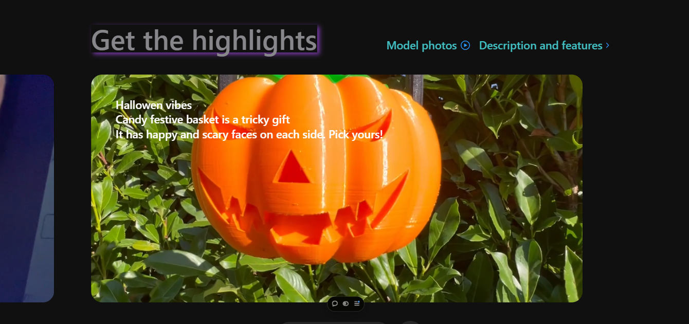

<div align="center">

<h1 align="center">
  
  3Degrees — Art Portfolio Website
</h1>

</div>

---

<div>

## 📌 Project Overview

**3Degrees** is a custom-built, high-performance website developed for a **private client** to showcase and represent his **artistic work** in an immersive and modern digital format.

The project focuses on **visual storytelling**, smooth animations, and **interactive 3D elements** to reflect the client’s artistic identity while maintaining excellent performance and responsiveness across devices.

This was a **freelance project delivered to a real client**, from concept to production-ready implementation, and I continue to work on the platform as a **frontend developer responsible for regular maintenance, updates, and performance improvements**.

</div>

---

<div>

## ✨ Key Features

- Fully responsive layout (desktop, tablet, mobile)
- Immersive 3D scenes rendered with WebGL
- Smooth, timeline-based animations
- Modern UI with clean typography and spacing
- Optimized performance and fast load times
- Production error monitoring and tracing
- Scalable and maintainable component architecture

</div>

---

<div>

## 🧩 Tech Stack

### Frontend
- **React 18** — Component-based UI development
- **Vite** — Fast development server and optimized builds
- **React Router DOM** — Client-side routing
- **Tailwind CSS** — Utility-first styling
- **PostCSS & Autoprefixer** — CSS optimization and browser compatibility

### Animation & 3D
- **GSAP** & **@gsap/react** — Advanced animations and timelines
- **Three.js** — WebGL-based 3D rendering
- **@react-three/fiber** — React renderer for Three.js
- **@react-three/drei** — Helpers and abstractions for 3D scenes

### Monitoring & Stability
- **Sentry** — Error tracking, performance monitoring, and tracing
- **Sentry Vite Plugin** — Build-time instrumentation

### Tooling & Quality
- **TypeScript** — Type safety and scalability
- **ESLint** — Code quality and consistency
- **Vite Plugin React** — Fast Refresh and optimized developer experience

</div>

---

<div>

## 👩‍💻 My Responsibilities

- Collaborated directly with the client to understand artistic vision and goals
- Designed and implemented a scalable React architecture
- Developed interactive 3D scenes using Three.js and React Three Fiber
- Integrated GSAP animations to enhance visual storytelling
- Optimized performance, rendering, and responsiveness
- Implemented production error tracking and monitoring with Sentry
- Provided ongoing maintenance, updates, and performance improvements

</div>

---

<div>

## 📸 Screenshots

<p align="center">
  
</p>

<p align="center">
  
</p>

<p align="center">
  
</p>

<p align="center">
  
</p>

</div>

---

<div>

## ▶️ Getting Started

```bash
# Clone the repository
git clone https://github.com/your-username/3Degrees_site.git

# Install dependencies
npm install

# Start development server
npm run dev

# Build for production
npm run build

# Preview production build
npm run preview


